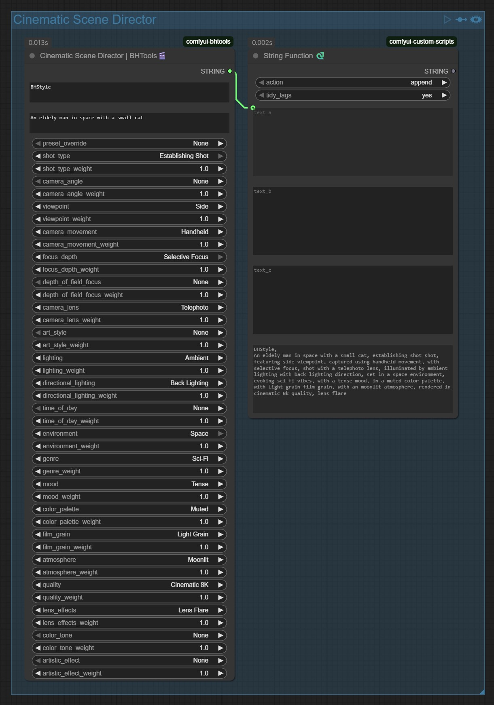

# BHTools 🎬

BHTools is a collection of custom tools and nodes designed to enhance creative workflows by merging traditional film, VFX, and animation techniques with innovative AI-driven methods. Developed by BrettMedia, these tools empower visual storytellers to generate cinematic prompts and streamline their production pipelines.

## Overview

BHTools integrates a suite of custom nodes that simplify crafting detailed cinematic scene descriptions. These tools help you fine-tune parameters like composition, camera angle, lighting, mood, and technical aesthetics.

## Custom Node: CinematicSceneDirectorBHTools

<div style="float: right; heigh: 25%; width: 25%; margin-left: 1em;">
  <a href="./images/CinematicSceneDirectorBHTools.jpg" target="_blank">
    
  </a>
</div>

**CinematicSceneDirectorBHTools** is a highly flexible node within the BHTools collection. It generates comprehensive cinematic scene prompts through a range of optional inputs—ensuring you can tailor the output to your needs without being forced to fill every field.

## How to Download and Use for ComfyUI

To install this node and use it with ComfyUI, follow these instructions:

1. **Clone the Repository:**
   Terminal into your ComfyUI `custom_nodes` folder (typically within your ComfyUI installation directory)
   ```bash
   git clone https://github.com/BrettMedia/comfyui-bhtools.git
   ```
 2. **Restart ComfyUI** to load the new custom node.
 3. Included simple workflow.

## How It Works

- **Optional Input Fields:**  
  The node processes various optional inputs:
  - **Trigger Words (LORA Triggers):** Use these to rapidly invoke thematic styles or moods.
  - **Prompt Description:** A text field for describing your scene in detail; this narrative forms the creative prompt.
  - **Preset Override:** Presets can automatically apply predefined parameters to complement your input.
  
- **Parameter Weighting:**  
  Additional optional parameters include:
  - **Composition / Camera Perspective:** Controls like shot type, angle, and movement.
  - **Camera Details:** Adjustments for focus, depth-of-field, and lens specifics.
  - **Style, Mood & Lighting:** Options for art style, time of day, lighting mood, and overall atmosphere.
  - **Aesthetic Adjustments:** Fine-tuning settings for color palettes, film grain, and other visual effects.
  
  Each provided input is weighted to determine its influence on the final cinematic prompt. Omitted inputs drop to zero, allowing defaults or bypassing that parameter entirely. This ensures that even minimal input (e.g., just a trigger word) produces a coherent and compelling scene description.

## Example Generated Code

```python
# Example: Generate a cinematic scene prompt using the custom node
from cinematic_node import CinematicSceneDirectorBHTools

node = CinematicSceneDirectorBHTools()
result = node.generate_prompt(
    trigger_word="Epic",              # LORA-like trigger word
    prompt="A breathtaking view of ancient ruins at sunrise",  # Narrative description
    preset_override="Epic Adventure", # Optional preset to apply default settings
    shot_type="Wide Shot",            # Optional composition parameter
    camera_angle="Eye-Level",         # Optional camera perspective
    lighting="Natural"                # Optional lighting parameter
)
print(result)
```
